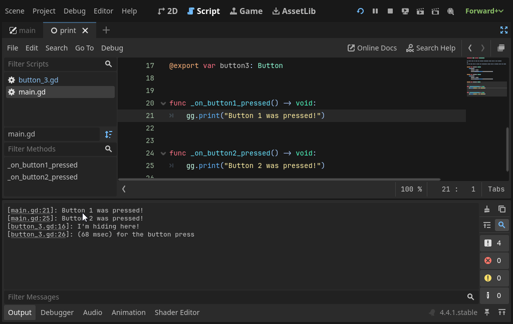

## gg.print() - Print clickable messages to the Godot editor output panel that link back to the source.


Sometimes it's just easier to debug code by adding `print()` statements.
This is especially the case when you're dealing with complex interactions across multiple scripts or when using breakpoints is not an option.
When debugging multiplayer code between server and client, for example, breakpoints typically result in the client disconnecting.

This plugin provides a simple "`gg.print()`" method that is intended as a drop-in replacement for the regular `print()` function.

When printing to the Godot editor's output panel, it includes a clickable link back to the source code where the `gg.print()` method was called:





## Requirements

This plugin was created with Godot Engine 4.4. You can probably make it work with Godot 4.2 and perhaps even earlier versions.
The plugin doesn't really use any fancy resources or new GDScript syntax like typed Dictionaries.


## Installation

You only need the files in the `addons/gg_print` directory.
Add them to your project, and enable the plugin by going to `Project -> Project Settings` and finding the `gg.print() editor integration` plugin in the `Plugins` tab.


## Demo

Run the `demo/main.tscn` scene and click the buttons to see print messages in the output panel.
Clicking the messages will take you to the script source.


## How it works

This little project was inspired by [this reddit post](https://www.reddit.com/r/godot/comments/1cc0zh3/easier_way_to_find_what_script_is_printing_a_msg/) asking if print messages can link back to the source script in the editor.

Since the Godot editor is powered by the Godot Engine, it's possible with an [EditorPlugin](https://docs.godotengine.org/en/stable/tutorials/plugins/editor/making_plugins.html).

The plugin does two things:

1. Provides a `gg` [singleton/autoload](https://docs.godotengine.org/en/stable/tutorials/scripting/singletons_autoload.html) with a `print()` method that uses [`print_rich()`](https://docs.godotengine.org/en/stable/classes/class_@globalscope.html#class-globalscope-method-print-rich) to print messages with a link that contain the stack trace (via [`get_stack()`](https://docs.godotengine.org/en/stable/classes/class_@gdscript.html#class-gdscript-method-get-stack)).
2. Attaches a [`meta_clicked`](https://docs.godotengine.org/en/stable/classes/class_richtextlabel.html#class-richtextlabel-signal-meta-clicked) signal handler to the `EditorLog` (the Godot editor output panel), so that clicks on the link can be opened in the editor.

With that, it's possible to call:

```gdscript
gg.print("Clicking me links back to the source file.")
```


## Notes

- Since the clickable-print feature is an [EditorPlugin](https://docs.godotengine.org/en/stable/classes/class_editorplugin.html) and `gg.print()` is meant for debugging, calling it in exported games won't print anything.
- Unlike regular `print()`, `gg.print()` only accepts a single string ([variadic functions are still in the proposal stage](https://github.com/godotengine/godot-proposals/issues/1034)). In other words, you cannot provide multiple comma separated parameters.
- The [`EditorInterface`](https://docs.godotengine.org/en/stable/classes/class_editorinterface.html) helps when creating editor plugins, but I was surprised that there's no clean, good way to get access to any of the existing panels. Plugins have to traverse the tree themselves, which feels a bit brittle. The [EditorLog](https://github.com/godotengine/godot/blob/4.2.2-stable/editor/editor_log.cpp#L384) defines the node structure in the source.


## Frequently asked questions


### I'm clicking on output panel links, why is it not working?

Ensure you have the "`gg.print() editor integration`" plugin enabled in `Project Setting > Plugins`.
It adds the required listener to the Output panel which handles the clicks.


### Naming it `gg.print()` seems weird.

That's not a question.
But there are multiple reasons.

1. I'm using the `GG` prefix for all addons I create, because GDScript doesn't have namespaces, and I want to ensure there are no conflicts when mixing it with other addons (insert rant here about every third addon trying to define a `Utils` class), therefore, it's the class is called `GGPrint`.
2. I wanted something short, and the `gg` works -- don't even have to hold shift. And you can always just remove the `gg.` prefix, and now you have a regular print statement (and vice versa).
